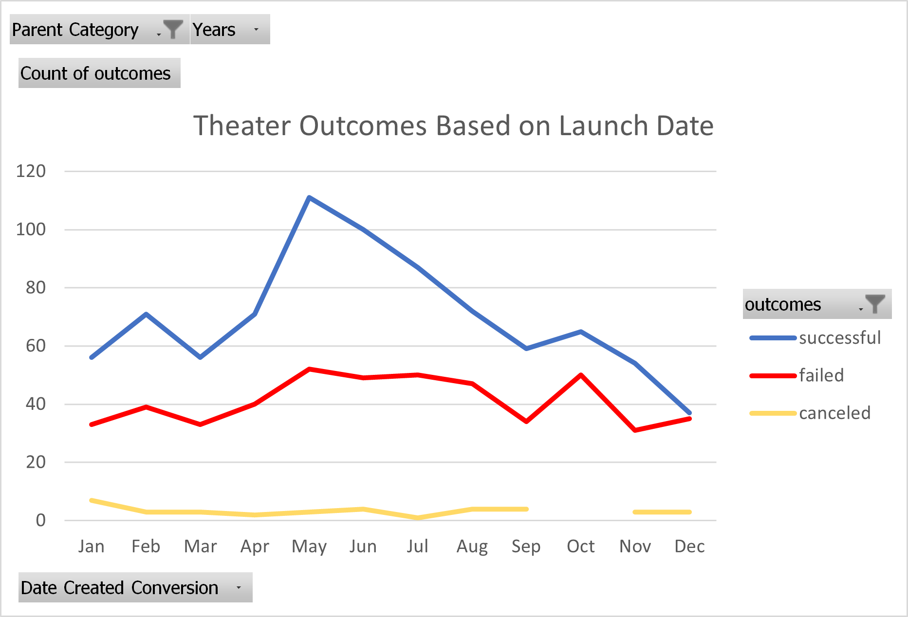
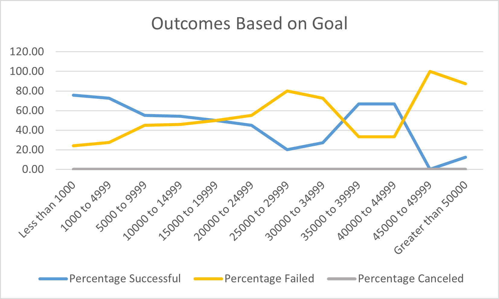
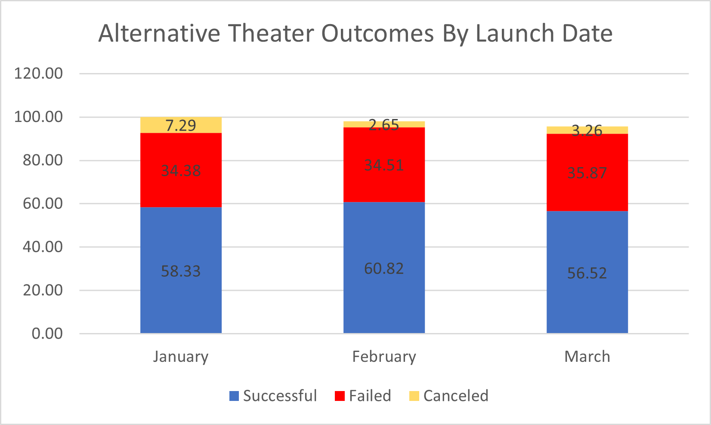

# Module 1 Kickstarting with Excel Written Analysis

## **Overview of Project**

### Purpose
The purpose of this project is to extract insights from a dataset on a wide range of kickstarter campaigns. These campaigns were for everything from theater productions to food trucks. Each campaign included information such as campaign funding goal, amount pledged, the dates of the campaigns, and other pertinent information. Using the insights generated by this analysis, I aim to better understand the characteristics of successful (and unsuccessful) projects.

## **Analysis and Challenges**
### Analysis of Outcomes Based on Launch Date
The goal of this project is to determine and exploit any clear trends that suggest a relationship between a theater project's eventual success/failure and the date which its associated kickstarter campaign was launched. 

**Figure 1**

**Figure 1** shows that May is the month in which the most successful kickstarter campaigns are launched. However what is also true is that May is the month in which the most failed kickstarter campaigns are launched. In fact the peaks and troughs of both trend lines mirror one another thoughout the year. Between January and February, there is an uptick in both the number of failed projects and the number of successful projects. This is followed by decline in March, upticks in April and May. In the summer months of May, June, and July there are more successful projects than failed projects, however the decline in successful projects is greater in magnitude than the decline in failed projects, which more closely resembles a plateau. Therefore relatively fewer projects are succesfful later in the summer compared to the proportion of successful projects that were launched in May. Fall leads to a decline in both the number of successful and failed projects, except for an uptick in October. The number of successful and failed projects reaches their toughs in December. However, because the number of projects that succeed (37)is very close to the number of projects that fail (35), this means that there is roughly a fifty percent chance your project will fail, even though in absolute terms, December is the month plagued with the fewest failed projects. 

### Analysis of Outcomes Based on Goals

The goal of this project is to determine and exploit any clear trends that suggest a relationship between a theater project's eventual success/failure and the fundraising goal dollar amount for the associated kickstarter campaign.

**Figure 2**

**Figure 2**, at first glance, suggests that the percentage of projects that fail increases as the campaign fundraising goal increases, until the percentage of projects that fail starts declining for porojects in the $30,000 to $45,000 range. Someone looking at the graph in this frame of mind could be forgiven for believing that a project has a better chance of succeeding if the project goal is $42,000 vs $25,000, for example. However this does not take into account the small sample sizes seen for the larger dollar amount categories and therefore could be an incorrect assessment. Reviewing the data and seeing that there are more than 50 total projects for each the three categories of project goals less than $10,000. There are only 26 projects in our dataset for the five fundraising categories between $25,000 abnd $50,000. There are not enough datapoints for these categories to have confidence in the results displayed. A challenge for future analysts would be to collect additional datapoint for theater projects with campaign goals greater than $25,000. However because the sample sizes are large enough for the categories less than $25,000 -- and especially for those les than $15,000 as sample sizes greater than fifty observations is generally accepted as robust -- we can still glean some valuable observations for these smaller projects. The primary obeservation is that campaigns with smaller goals are more likely to lead to successful projects. 

### Challenges and Difficulties Encountered
One challenge I faced was remembering what data points actually represented. For example, it was easy to forget that the years were referring to the kickstarter campaigns, not the year the theater production debuted; this is a relatively minor mistake but if duplicated across another dataset, the results could be skewed. Reminding oneself of what the data represents, especially when thinking in abbreviations and shortcuts, is critical in order to maintain accurate findings. 

Another challenge was the dollar amount categories for theater productions' kickstarter campaigns do not precisely capture the full range of goals. For example one category ranges from $1,000 to $4,999 and the next picks up at $5,000 and extends until $9,999, etc. This leaves a gap in the data if not accounted for, which I did, by adjusting the ranges in my Countifs statements to include decimal points ".99" to many of my observed ranges. 

## **Results**

- **What are two conclusions you can draw about the Outcomes based on Launch Date?**

A kickstarter campaign which begins in May has the highest probability of succeeding, though this is the month in which the most failed projects were launched. A kickstarter campaign launched in December has the highest probability of failure, even though this is the month with the fewest number of failed projects.

- **What can you conclude about the Outcomes based on Goals?**

A kickstarter campaign will lead to a successful project, in general, if the campaign goal is smaller. Projects become successful less than 50% of the time after the goal surpasess $20,000 - excluding unreliable datapoints beyond $35,000 (see below).

- **What are some limitations of this dataset?**
As touched on previously and alluded to directly above, the dataset has a serious limitation when observing projects based on their kickstarter campaign goals. One strength of the outcomes based on dates, when compared to the outcomes based on goal, is the fact that each month has roughly the same number of observations with a range of 75 to 166. This is not reflected in the outcomes by campaign goal. There are not enough data points for projects with larger goals to determine if our observations reflect reality. Future researchers should seek additional datapoints if possible. If not possible, then researchers should explain the limitations of the data and seek other methods for reflecting outcomes.

- **What are some other possible tables and/or graphs that we could create?**

The chart reflecting the theater outcomes based on launch date could be improved by not showing the *number* of successful, failed, and canceled but by showing a stacked bar graph with the percentage each result recieved so that failure and success are standardized across the months. See **Figure 3** below.

**Figure 3**

