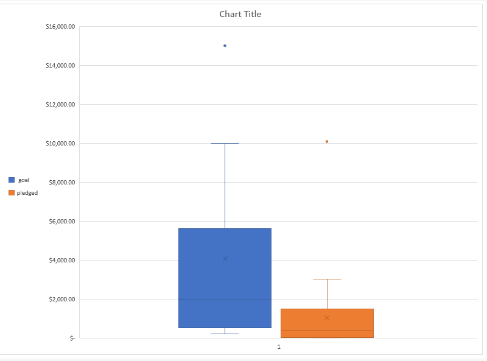

# An Analysis of Kickstarter Campaigns
Contains raw data and Initial Analysis in Excel
# Summary of Findings
Successful Plays had Mean Goal of $5,049
Successful Plays had Mean Pledge of $5,061
Successful plays pledge Upper Quartile - 5,699; Lower Quartile - $1,717
## Below is a Box and Whisker Chart

###This is a test to see if I have GitHub DeskTop up and running. 3-6-9